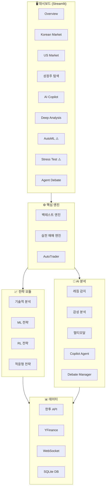

# 📊 stock_auto 프로젝트 심층 분석 리포트 V2

> **분석 일시**: 2026-02-09  
> **분석 방법**: SequentialThinking MCP 기반 6단계 Chain of Thought  
> **분석자 역할**: 수석 제품 관리자(Senior PM) & 시스템 아키텍트
> **기준 버전**: PM_ANALYSIS_REPORT.md 이후 업데이트

---

## 📋 V1 보고서 이후 구현 현황

PM_ANALYSIS_REPORT.md에서 제안한 6가지 혁신 기능 중 **5가지가 구현 완료**되었습니다:

| 제안 기능 | 상태 | 구현 위치 |
|----------|:----:|----------|
| AI 트레이딩 코파일럿 | ✅ 완료 | `src/copilot/agent.py` |
| 실시간 레짐 감지 AI | ✅ 완료 | `src/analysis/regime.py` |
| 멀티모달 시그널 통합 | ✅ 완료 | `src/analysis/multimodal.py` |
| 포트폴리오 스트레스 테스트 | ✅ 완료 | `src/analysis/stress.py` |
| 에이전트 멀티 컨센서스 | ✅ 완료 | `src/copilot/debate.py` |
| 유전자 알고리즘 AutoML | ⏳ UI 미완성 | `src/optimization/genetic.py` |

### 추가 구현 완료 항목
- `RegimeDetector` + `AdaptiveStrategy`: `src/strategies/adaptive_strategy.py`
- 레짐 모델 저장: `data/regime_model.pkl`
- 대시보드 9개 탭 구조: Overview, KR, US, 성장주, AI Copilot, Deep Analysis, AutoML, Stress Test, Agent Debate

---

## 1. 🛠️ 수정 및 개선이 필요한 부분 (Critical Fixes)

### 🔴 HIGH PRIORITY

| 문제점 | 설명 | 해결책 |
|--------|------|--------|
| **대시보드 코드 불완전** | `dashboard/app.py`에서 `load_state`, `render_*` 함수가 정의되지 않음 (라인 77-79 생략됨). 실행 시 `NameError` 발생 | 누락된 함수들 정의 또는 별도 모듈에서 import 추가 |
| **Stress Test 탭 미완성** | "Run Stress Test" 버튼만 존재. `TODO: 실제 포트폴리오 데이터 연동` 주석만 있음 (라인 221-225) | `trading_state.json`에서 포지션 로드 → `StressTester.simulate_scenario()` 연동 |
| **AutoML 탭 껍데기** | `GeneticOptimizer` import만 있고 UI 없음 (라인 206-211). st.info만 표시 | 파라미터 입력 폼 + 진화 시작 버튼 + 결과 시각화 추가 |
| **대시보드 참조 함수 누락** | `render_overview_tab`, `render_market_tab`, `render_growth_tab` 함수 정의 없음 | 각 탭 렌더링 함수를 `dashboard/components/` 모듈로 분리하거나 app.py에 정의 |

### 🟡 MEDIUM PRIORITY

| 문제점 | 설명 | 해결책 |
|--------|------|--------|
| **Debate 기능 단순함** | `DebateManager.run_debate()`가 단일 ticker만 처리. 포트폴리오 전체 토론 불가 | 다중 ticker 지원 + 우선순위 반환 로직 추가 |
| **에러 핸들링 미흡** | 대시보드 일부 탭에서 try-except 없이 외부 API 호출 (라인 173-182 제외) | 모든 외부 호출에 예외 처리 + 폴백 UI 추가 |
| **설정 분산** | `.env`, `config/`, `src/config.py` 3곳에 설정 분산 | 단일 설정 진입점 (Config.load_all()) 구현 |

---

## 2. 🧩 누락된 필수 요소 (Missing Components)

### 보안 계층 (Security)

| 누락 요소 | 현재 상태 | 필요성 | 우선순위 |
|-----------|----------|--------|:--------:|
| 감사 로그 (Audit Trail) | ⛔ 없음 | 누가 언제 무슨 주문을 넣었는지 추적 불가. 규제 준수 필수 | 🔴 |
| 입력 검증 (Input Validation) | ⚠️ 미흡 | 대시보드 ticker 입력 검증 없음. 인젝션 취약점 가능 | 🟡 |
| Rate Limiting (대시보드) | ⛔ 없음 | API 남용 방지 불가 | 🟡 |

### 관측성 (Observability)

| 누락 요소 | 현재 상태 | 필요성 | 우선순위 |
|-----------|----------|--------|:--------:|
| APM (Application Performance Monitoring) | ⛔ 없음 | 성능 병목 식별 어려움 | 🟡 |
| 분산 트레이싱 | ⛔ 없음 | API → 전략 → 주문 흐름 추적 불가 | 🟡 |
| Prometheus 메트릭 익스포터 | ⛔ 없음 | Grafana 대시보드 연동 불가 | 🟢 |
| 헬스체크 엔드포인트 | ⛔ 없음 | 외부 모니터링 불가 (Uptime Robot 등) | 🟡 |

### MLOps 완성도

| 누락 요소 | 현재 상태 | 필요성 | 우선순위 |
|-----------|----------|--------|:--------:|
| A/B 테스트 프레임워크 | ⛔ 없음 | 새 모델 vs 기존 모델 실전 비교 불가 | 🔴 |
| 모델 드리프트 감지 | ⛔ 없음 | 시간 경과에 따른 성능 저하 감지 불가 | 🟡 |
| 피처 스토어 | ⛔ 없음 | 피처 재사용 및 일관성 관리 어려움 | 🟢 |

### 데이터 파이프라인

| 누락 요소 | 현재 상태 | 필요성 | 우선순위 |
|-----------|----------|--------|:--------:|
| 데이터 품질 모니터링 | ⛔ 없음 | 누락/이상 데이터 자동 감지 불가 | 🟡 |
| 데이터 버전 관리 (DVC) | ⛔ 미사용 | 학습 데이터 재현성 보장 불가 | 🟢 |

---

## 3. 💡 AI가 제안하는 혁신 기능 (Innovative Features)

**(새로운 제안 - 기존 6개 기능 구현 이후)**

### 1. 🎯 AI 주문 흐름 예측기 (Order Flow Intelligence)

**개념:**
체결 데이터와 호가창 불균형을 실시간 분석하여 기관/외국인 매매 방향을 예측합니다.

**Why 획기적인가?**
- 현재 전략은 가격/거래량 기반이지만, **호가 불균형이 단기 방향성의 선행 지표**
- 개인투자자가 접근하기 어려운 **정보 우위** 확보
- 체결강도, 매수잔량비율 등 한투 WebSocket에서 제공하는 데이터 활용

**구현 팁:**
```
기술 스택: 한투 WebSocket 호가창 스트림 + LSTM
인풋: 매도/매수 호가 불균형, 체결강도, 순매수량
출력: 5분 후 방향 예측 (상승/하락/횡보)
```

| 기대 효과 | 구현 난이도 |
|:--------:|:--------:|
| ★★★★★ | ★★★★☆ |

---

### 2. 🤖 Self-Healing Trading Engine

**개념:**
장애 발생 시 자동 복구 + 부분 실패 시 보상 트랜잭션(Saga 패턴) 실행

**Why 획기적인가?**
- 현재 Circuit Breaker는 **차단만 하고 복구 로직 없음**
- 주문 부분 체결 시 **롤백/헤지 메커니즘 부재**
- 시스템 무결성 필수 요구사항

**구현 팁:**
```
기술 스택: Python StateMachine 라이브러리
상태 정의: IDLE → PLACING → PARTIAL_FILL → HEDGING → COMPLETE
보상 로직: 5분 내 미체결 → 잔량 시장가 매도 or 헤지 포지션 진입
```

| 기대 효과 | 구현 난이도 |
|:--------:|:--------:|
| ★★★★★ | ★★★☆☆ |

---

### 3. 📊 포트폴리오 DNA 매칭

**개념:**
사용자 성향(공격적/보수적)을 분석하여 최적 전략을 자동 매칭합니다.

**Why 획기적인가?**
- 현재는 사용자가 **직접 전략 선택** (진입장벽)
- 성향 미스매치 시 **조기 손절 → 이탈**
- 온보딩 경험 개선

**구현 팁:**
```
단계 1: 5문항 간단 설문 (손실 허용도, 투자 기간, 목표 수익률)
단계 2: 과거 투자 이력 분석 (있는 경우)
결과: 전략별 리스크 프로파일과 매칭 (e.g., "당신은 Mean Reversion + 낮은 레버리지가 적합합니다")
```

| 기대 효과 | 구현 난이도 |
|:--------:|:--------:|
| ★★★★☆ | ★★☆☆☆ |

---

### 4. 🌐 크로스마켓 아비트리지 탐지기

**개념:**
KR-US 시장 간 ADR/원주식 괴리율, ETF-펀더멘털 괴리를 자동 탐지합니다.

**Why 획기적인가?**
- 현재 KR/US 시장을 **독립적으로 운용**
- 삼성전자 - SSNLF ADR, KODEX 미국나스닥100 - QQQ 괴리 등 활용 가능
- **무위험 초과수익** 기회 탐지

**구현 팁:**
```
연동: 실시간 환율 API (한국은행/Korea Exim Bank)
탐지: 괴리율 > 2% 시 알림
전략: 페어 트레이딩 자동 생성 (long 저평가, short 고평가)
```

| 기대 효과 | 구현 난이도 |
|:--------:|:--------:|
| ★★★★☆ | ★★★★★ |

---

### 5. 🧠 LLM 기반 실시간 공시 파싱

**개념:**
DART/SEC 공시를 LLM이 즉시 요약 + 주가 영향도 평가

**Why 획기적인가?**
- 현재 **뉴스 감성 분석은 있지만 공시 파싱 없음**
- 공시는 뉴스보다 **직접적이고 신뢰도 높은 정보**
- 유상증자, M&A, 대규모 계약 체결 등 **시가총액 변동 이벤트** 포착

**구현 팁:**
```
기술 스택: DART OpenAPI + Gemini Pro
파이프라인:
1. 실시간 공시 폴링 (1분 간격)
2. 공시 유형 필터링 (주요사항보고서, 지분공시 등)
3. LLM 요약 + 영향도 점수 (-1 ~ +1)
4. 임계값 초과 시 알림 + 자동 매매 신호 생성
```

| 기대 효과 | 구현 난이도 |
|:--------:|:--------:|
| ★★★★★ | ★★★☆☆ |

---

### 6. 📱 모바일 알림 + 원터치 승인

**개념:**
중요 매매 시그널 발생 시 모바일 푸시 → 한 번 터치로 주문 승인

**Why 획기적인가?**
- 현재 Discord 알림은 **수동 확인 필요**
- 시간에 민감한 매매 기회 **놓침 방지**
- 사용자 **참여도 및 신뢰도** 향상

**구현 팁:**
```
옵션 1: Telegram Bot + Inline Keyboard (승인/거부/수정)
옵션 2: Firebase Cloud Messaging + 딥링크로 대시보드 연결
승인 플로우: 푸시 → 터치 → 주문 확인 화면 → 실행
보안: OTP 또는 PIN 인증 필수
```

| 기대 효과 | 구현 난이도 |
|:--------:|:--------:|
| ★★★★☆ | ★★☆☆☆ |

---

## 4. 📅 종합 의견 및 우선순위

### 💬 총평

프로젝트는 **V1 분석 이후 놀라운 진전**을 보였습니다:
- 6가지 제안 중 5가지 구현 완료
- AI 기능 (Copilot, Multimodal, Debate)이 실제 동작
- 대시보드 9탭 구조로 확장

그러나 **프로덕션 배포 전 필수 수정 사항**이 남아있습니다:
- 대시보드 실행 불가 상태 (함수 정의 누락)
- AutoML/Stress Test 탭 UI 미완성
- 감사 로그/모니터링 인프라 부재

---

### 🚀 실행 로드맵

#### 🔴 Phase 1: 즉시 적용 (1-2주)

| 우선순위 | 작업 | 예상 공수 | 임팩트 |
|:--------:|------|:---------:|:------:|
| 1 | 대시보드 함수 정의 완성 | 2일 | ★★★★★ |
| 2 | Stress Test 포트폴리오 연동 | 1일 | ★★★★☆ |
| 3 | AutoML 탭 UI 구현 | 2일 | ★★★★☆ |
| 4 | 감사 로그 (Audit Trail) 추가 | 2일 | ★★★★★ |

#### 🟡 Phase 2: 단기 개선 (1개월)

| 우선순위 | 작업 | 예상 공수 | 임팩트 |
|:--------:|------|:---------:|:------:|
| 5 | **Self-Healing Engine (Saga 패턴)** | 1주 | ★★★★★ |
| 6 | **LLM 기반 공시 파싱** | 1주 | ★★★★★ |
| 7 | A/B 테스트 프레임워크 | 1주 | ★★★★☆ |
| 8 | 모바일 알림 (Telegram/FCM) | 3일 | ★★★★☆ |

#### 🟢 Phase 3: 중장기 혁신 (3개월)

| 우선순위 | 작업 | 예상 공수 | 임팩트 |
|:--------:|------|:---------:|:------:|
| 9 | **Order Flow Intelligence** | 3주 | ★★★★★ |
| 10 | 크로스마켓 아비트리지 | 3주 | ★★★★☆ |
| 11 | 포트폴리오 DNA 매칭 | 1주 | ★★★☆☆ |
| 12 | APM/분산 트레이싱 | 2주 | ★★★☆☆ |

---

### 🏆 가장 높은 ROI 추천 (Top 3)

> [!IMPORTANT]
> 아래 3가지 작업은 **투자 대비 수익**이 가장 높습니다.

1. **대시보드 완성** - 현재 실행 불가 상태 해결
2. **Self-Healing Engine** - 프로덕션 안정성 확보
3. **LLM 공시 파싱** - 정보 우위로 알파 창출

---

## 📝 사용자 검토 필요 항목

> [!CAUTION]
> 다음 항목들은 구현 전 사용자 의사결정이 필요합니다.

1. **대시보드 우선순위** - 기존 코드 복구 vs 전면 재작성
2. **감사 로그 범위** - 모든 API 호출 기록 vs 주문만 기록
3. **공시 파싱 범위** - 한국(DART)만 vs 미국(SEC) 포함
4. **모바일 알림 플랫폼** - Telegram vs 카카오톡 vs 전용 앱

---

## 📊 아키텍처 다이어그램 (현재 상태)



---

*이 분석 리포트는 SequentialThinking MCP를 활용한 6단계 Chain of Thought 기반으로 작성되었습니다.*
